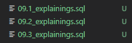
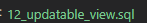

# Звіт з лабораторної роботи №5

## Загальна інформація
- ПІБ студента: Шипкін Денис.
- Група: ІПЗ-32.
- Варіант: Система обліку книжкового магазину.
- Рівень виконання: 3.

# РІВЕНЬ 1
## Завдання 1: Проаналізувати продуктивність трьох складних запитів за допомогою команди EXPLAIN ANALYZE.


На скріншоті - ті запити, які були додані відповідно до цього завдання.

## Завдання 2: Створити три індекси для оптимізації найбільш повільних запитів та перевірити покращення продуктивності.
Змінено 02_create_indexes.sql. Там і так існувало достатьно індексів, але було додано ще два:
```sql
CREATE INDEX idx_books_price ON books(price);

CREATE INDEX idx_supplies_delivery_date ON supplies(delivery_date)
```

## Завдання 3: Створити два представлення (VIEW) для спрощення доступу до часто використовуваних запитів.
```sql
CREATE VIEW view_orders_full AS
SELECT 
    o.order_id,
    c.full_name AS customer,
    e.full_name AS employee,
    o.order_date,
    o.total_amount
FROM orders o
JOIN customers c ON o.customer_id = c.customer_id
JOIN employees e ON o.employee_id = e.employee_id;

CREATE VIEW view_books_authors AS
SELECT 
    b.book_name,
    a.name AS author,
    b.price
FROM books b
JOIN authors a ON b.author_id = a.author_id;
```

## Завдання 4: Розробити тригер для автоматичного логування операцій вставки або оновлення в одній з таблиць.
```sql
CREATE OR REPLACE FUNCTION log_order_insert()
RETURNS TRIGGER AS $$
BEGIN
    INSERT INTO activity_log(user_id, action, table_name, record_id)
    VALUES (1, 'INSERT', 'orders', NEW.order_id);
    RETURN NEW;
END;
$$ LANGUAGE plpgsql;

CREATE TRIGGER trg_log_order_insert
AFTER INSERT ON orders
FOR EACH ROW
EXECUTE FUNCTION log_order_insert();
```
Створений тригер, який буде викликати функцію перевірки.


# РІВЕНЬ 2
## Завдання 1: Створити складне представлення з можливістю оновлення через правила (RULES).

На скріншоті - запит (сама назва), який відповідає умовам завдання.

## Завдання 2: Реалізувати тригер для валідації даних перед вставкою з відхиленням некоректних значень.
```sql
CREATE OR REPLACE FUNCTION validate_book_price()
RETURNS TRIGGER AS $$
BEGIN
    IF NEW.price <= 0 THEN
        RAISE EXCEPTION 'Ціна не може бути нуль або відʼємна';
    END IF;
    RETURN NEW;
END;
$$ LANGUAGE plpgsql;

CREATE TRIGGER trg_validate_price
BEFORE INSERT ON books
FOR EACH ROW
EXECUTE FUNCTION validate_book_price();
```
Цей тригер буде викликати функцію, яка перевірятиме, чи ціна не від'ємна.

## Завдання 3: Розробити систему логування змін з окремою таблицею audit_log, яка зберігає:
### тип операції (INSERT, UPDATE, DELETE)
### назву таблиці
### часову мітку
### користувача, який виконав операцію
### старі та нові значення (для UPDATE)
```sql
CREATE OR REPLACE FUNCTION audit_trigger()
RETURNS TRIGGER AS $$
BEGIN
    INSERT INTO activity_log (
        user_id,
        action,
        table_name,
        record_id,
        old_data,
        new_data
    )
    VALUES (
        NULL,               -- або current_user, якщо без users
        TG_OP,
        TG_TABLE_NAME,
        COALESCE(NEW.book_id, OLD.book_id),
        CASE WHEN TG_OP IN ('UPDATE','DELETE') THEN row_to_json(OLD)::jsonb END,
        CASE WHEN TG_OP IN ('INSERT','UPDATE') THEN row_to_json(NEW)::jsonb END
    );

    RETURN NEW;
END;
$$ LANGUAGE plpgsql;

CREATE TRIGGER trg_audit_books
AFTER INSERT OR UPDATE OR DELETE ON books
FOR EACH ROW
EXECUTE FUNCTION audit_trigger();
```

## Завдання 4: Створити часткові індекси для оптимізації запитів з WHERE умовами.
```sql
CREATE INDEX idx_books_expensive ON books(price)
WHERE price > 400;

CREATE INDEX idx_orders_recent ON orders(order_date)
WHERE order_date > '2024-03-01';

```

## Завдання 5: Виконати резервне копіювання бази даних командою pg_dump та відновлення з резервної копії.
[Файл бекапу](/backup.sql)
Також після цього було зроблено повне відновлення усіх файлів.

# РІВЕНЬ 3
## Завдання 1: Створити матеріалізоване представлення (MATERIALIZED VIEW) з агрегованими даними та налаштувати його автоматичне оновлення через тригери.
[Посилання на файл](/database/queries/16_materialized_view.sql)

## Завдання 5: Розробити скрипт для автоматизованого моніторингу продуктивності з виведенням статистики використання індексів та найповільніших запитів.
[Посилання на файл](/database/queries/17_monitoring.sql)

# Висновки
У ході лабораторної роботи було покращено знання з роботи з мовою PSQL, а також було покращено загальне розуміння роботи з запитами.